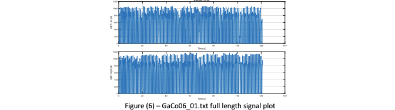
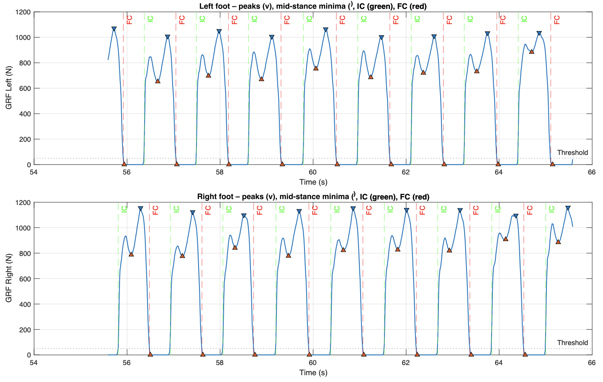

# Gait Classification in Parkinson's Disease

Classifying Parkinson's disease vs healthy control participants from vertical ground-reaction-force (GRF) gait signals, using engineered biomechanical features and three classical ML approaches (KNN, SVM, Random Forest), evaluated with rigorous cross-validated wrapper-based feature selection.

## Why this problem

Parkinson's disease produces measurable, well-documented changes in gait reduced stride length, increased stride-time variability, gait asymmetry, and longer double-support phases. This project investigates if starting from raw force-plate signals recorded in participants' shoes, can a small set of bio mechanical features fed into standard classifiers separate PD patients from healthy controls and which features and models actually drive that separation?

## Dataset

[PhysioNet's Gait in Parkinson's Disease Database](https://physionet.org/content/gaitpdb/1.0.0/), vertical GRF recordings from 8 sensors under each foot (16 total, plus 2 summed per-foot channels), sampled at 100 Hz during approximately 2 minutes of self-paced walking. Data originally collected by Yogev et al. [1] and Frenkel-Toledo et al. [2].

This analysis uses an 80 recording subset (40 PD, 40 control), selected via a fixed pre-assigned split from the full database, plus accompanying demographic data (age, height, weight, Timed Up and Go test time, and self-selected walking speed).

**Data isn't included in this repo**: it's available from PhysioNet directly. `demographics_reorder.m` filters the full demographics file down to the exact 80 recordings used here.

## Feature engineering

15 features total, each chosen for a specific connection to Parkinsonian gait:

**Demographic (5):** Age, Height, Weight, TUAG (Timed Up and Go is a standard clinical mobility/balance measure), Speed_01 (self-selected walking speed). Missing values imputed using cohort-specific (PD/control) means.

**Sensor-derived (10), extracted from the GRF waveforms via peak/threshold detection:**

| Feature | What it captures | Why it's relevant to PD |
|---|---|---|
| Step Count | Total detected "M" shaped force peaks | PD is associated with reduced cadence |
| Stride Time (mean) | Average time for one full gait cycle | PD often shows shortened, less rhythmic strides |
| Stride Time CV | Coefficient of variation in stride timing | Increased variability is one of the strongest gait markers of PD |
| Stride Time Asymmetry | Left/right stride time difference, normalized | PD onset is frequently asymmetric (one-sided) |
| Peak GRF (mean) | Average maximum force per step | Reduced muscle power can lower peak force in PD |
| Peak GRF (std) | Step-to-step force consistency | PD often shows irregular force production |
| Min GRF (mean) | Mid-stance trough force | Reflects balance/weight-transfer control |
| Double Support Ratio | Fraction of time both feet are grounded | PD patients increase double support to compensate for instability |
| Contact Time (mean) | Average stance duration per step | Longer, more deliberate contact time is common in PD |
| Loading Rate (mean) | Speed of force onset after ground contact | Reduced loading rate reflects more cautious, less dynamic gait |

Events (initial contact, final contact, peak, mid-stance minimum) are detected via threshold crossing and peak-finding on the per-foot GRF signal, illustrated below.

<p align="center">
  
</p>
<p align="center"><sub><i>Full-length total GRF signal for the left and right feet across the full ~2 minute recording.</i></sub></p>

<p align="center">
  
</p>
<p align="center"><sub><i>A 10-second segment of the same recording, with detected peaks (▽), mid-stance minima (△), initial contact (IC, green) and final contact (FC, red) marked — the exact event detection used to derive the temporal gait features below.</i></sub></p>

All 15 features are then min-max normalised to [0, 1] across the full dataset before modeling.

## Models and evaluation

Every model is evaluated inside 10-fold cross-validation with a wrapper-based (sequential) feature selection step nested inside each fold, and scored on three metrics: accuracy, F1, and AUC all reported as mean ± std across folds. This is deliberately more rigorous than a single train/test split as it avoids the optimistic bias of selecting features on the full dataset before splitting.

### K-Nearest Neighbours (K = 1, 3, 5, 7, 9)

| K | Accuracy | F1 | AUC | Avg. Features Selected |
|---|---|---|---|---|
| 1 | 0.613 ± 0.171 | 0.643 ± 0.159 | 0.604 ± 0.173 | 2.0 |
| 3 | 0.613 ± 0.171 | 0.588 ± 0.212 | 0.675 ± 0.182 | 1.7 |
| 5 | 0.662 ± 0.119 | 0.640 ± 0.144 | 0.675 ± 0.170 | 1.7 |
| **7** | **0.713 ± 0.103** | **0.687 ± 0.146** | **0.803 ± 0.128** | 1.8 |
| 9 | 0.750 ± 0.118 | 0.714 ± 0.175 | 0.791 ± 0.123 | 1.3 |

K=7 was selected as the best bias/variance trade-off (best AUC, strong F1) rather than simply the highest accuracy. TUAG was selected in nearly every fold as the single strongest predictor, with stride-time variability, stride-time mean, and stride-time asymmetry as secondary contributors.

Weighted KNN (inverse-distance weighting) at K=7 was then tested and performed slightly worse (Acc 0.663, F1 0.610, AUC 0.751) than the unweighted version.

### Support Vector Machine (C = 0.1, 1, 10)

Automatic (loss-driven) feature selection:

| C | Accuracy | F1 | AUC | Avg. Features |
|---|---|---|---|---|
| 0.1 | 0.600 ± 0.142 | 0.356 ± 0.348 | 0.554 ± 0.204 | 2.2 |
| 1 | 0.613 ± 0.199 | 0.512 ± 0.315 | 0.637 ± 0.209 | 3.5 |
| 10 | 0.675 ± 0.169 | 0.602 ± 0.227 | 0.720 ± 0.204 | 2.6 |

Fixed at 6 features (the max selected across any fold above):

| C | Accuracy | F1 | AUC | Features |
|---|---|---|---|---|
| 0.1 | 0.563 ± 0.179 | 0.440 ± 0.265 | 0.606 ± 0.238 | 6 |
| **1** | **0.738 ± 0.161** | **0.742 ± 0.165** | 0.725 ± 0.213 | 6 |
| 10 | 0.613 ± 0.150 | 0.522 ± 0.254 | 0.723 ± 0.204 | 6 |

Forcing more features only helped at the balanced regularisation setting (C=1) was too little regularisation (C=10) overfit to the extra features, too much (C=0.1) couldn't use them.

### Random Forest (100 trees vs. 20 trees)

| Trees | Accuracy | F1 | AUC | Avg. Features |
|---|---|---|---|---|
| 100 | **0.713 ± 0.167** | **0.699 ± 0.153** | **0.738 ± 0.188** | 2.4 |
| 20 (6 features forced) | 0.663 ± 0.145 | 0.652 ± 0.164 | 0.719 ± 0.167 | 6 |

Fewer trees increased variance and reduced performance, as expected from the reduced ensemble averaging. Forcing more features onto the smaller-forest model didn't help, extra, weaker features diluted the signal from the strongest predictors rather than adding new discriminative power.

## Key takeaways

- TUAG (a simple clinical mobility test) was consistently the single most powerful feature across models.
- Simply adding more features doesn't reliably help, its effect on model performance depends entirely on the interaction with regularisation/model capacity (clearest in the SVM results above).
- 10-fold cross-validated wrapper feature selection is meaningfully more informative than a single accuracy number: the std dev across folds (often 0.10-0.20) shows real fold-to-fold variability that a single train/test split would hide entirely.

## Limitations

This was completed as a university project on a small, fixed 80-recording subset (40/40 class split) of a public dataset, not a from-scratch research project on the full database. 
- No held-out test set beyond the CV folds themselves, reported metrics are cross-validation estimates, not a final generalisation test
- Best accuracy achieved was ~75%, AUC ~0.80, solid for a compact feature set on a small sample, but should be read as a methodology demonstration rather than a clinically deployable result

## Repository structure

```
.
├── feature_extraction.m       # Full pipeline: demographic + sensor feature extraction,
│                               # normalisation, KNN/SVM/Random Forest with CV + feature selection
├── demographics_reorder.m     # Filters the full PhysioNet demographics file down to
│                               # the 80-recording subset used here
└── data/                      # (not included — see Dataset section)
```

## Running it

1. Download the GRF `.txt` recordings and `demographics.xls` from [PhysioNet](https://physionet.org/content/gaitpdb/1.0.0/) into a local `data/` folder alongside these scripts.
2. Run `demographics_reorder.m` first — this produces `demographics_filtered.xlsx`, restricted to the 80 recordings used in this analysis.
3. Run `feature_extraction.m` — this runs the full pipeline end to end: feature extraction → normalization → KNN / SVM / Random Forest, each with nested cross-validated feature selection, printing summary tables and plotting PD-vs-control feature distributions along the way.

Requires MATLAB with the Statistics and Machine Learning Toolbox (`fitcknn`, `fitcsvm`, `fitcensemble`, `sequentialfs`, `cvpartition`).

## Citation

If referencing the dataset itself, please cite:
- Yogev, G., Giladi, N., Peretz, C., Springer, S., Simon, E.S., Hausdorff, J.M. "Dual tasking, gait rhythmicity, and Parkinson's disease." *European Journal of Neuroscience*, 22(5), 2005.
- Frenkel-Toledo, S., Giladi, N., Peretz, C., Herman, T., Gruendlinger, L., Hausdorff, J.M. "Effect of gait speed on gait rhythmicity in Parkinson's disease." *Journal of NeuroEngineering and Rehabilitation*, 2(1), 2005.
- Goldberger, A.L., et al. "PhysioBank, PhysioToolkit, and PhysioNet." *Circulation*, 101(23), 2000. (PhysioNet's required general citation for any dataset hosted there.)

## Author

**Stepan Letsko** 
